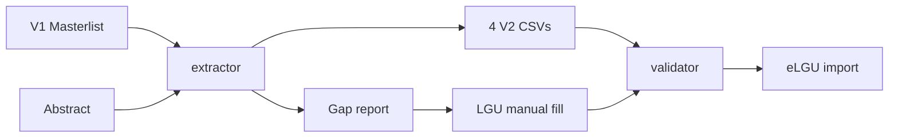

# BPLS App Improvement Roadmap

A prioritized discussion and improvement roadmap for the BPLS validator + V1→V2 extractor: what is already solid, what still blocks real LGU imports, and what decisions remain before more coding.

## Where things stand

Two companion tools exist and work for Region 2 offline use:

| Tool | Role | Branch |
|------|------|--------|
| [`index.html`](../index.html) | Validate/clean 4 V2 CSVs | `Extractor-v1-2-v2` (+ older cross-table branch) |
| [`extractor.html`](../extractor.html) | V1 masterlist (+ Abstract) → 4 CSVs + gap report | `Extractor-v1-2-v2` |

**Still not done for shipping:** merge both feature branches into `main` so one build has extractor + cross-table + Table 2 gross/LoB rules.

Related plans: [cross-table-validation.md](cross-table-validation.md), [v1-to-v2-extractor.md](v1-to-v2-extractor.md).

---

## Decided: privacy + Line of Business storage

**Privacy rule:** this app must **not save** LGU/business upload data (no server DB, no SQLite of taxpayer rows, no persisting CSVs). Data stays in browser memory for the session; user downloads results locally.

**Line of Business (Business Natures):** do **not** put LoB in SQLite/MySQL.

| Approach | Verdict |
|----------|---------|
| **Keep embedded reference file** (`data/business-natures.js` from Business Natures.xlsx) | **Recommended** — public catalog (~1360 codes), offline, no PII, already used for validate + search |
| SQLite / sql.js for LoB only | Not worth it — same static list, heavier (WASM), still ships the whole catalog |
| Server MySQL for LoB | Conflicts with offline + “do not save data” posture |

**What may stay in the browser (OK):** LGU picker selection, theme, editable validation rules in `localStorage` — not business masterlist content.

**Optional later (still privacy-safe):** allow LGU to *temporarily* load an alternate Business Natures CSV for the session (override), without writing it to a database.

---

## Discuss first (product / policy decisions)

These change design more than any code tweak. Agree on them with LGU / DICT stakeholders before building more rules.

1. **What is “good enough” to import?**  
   V1 alone cannot fill DTI expiry, owned/rented + TDN/PIN/lessor, SEC/CDA, barangay clearance. Decide: block export until filled, allow blanks with gap report only, or apply safe defaults (today: `location_owned=1`, citizenship Philippines, etc.).

2. **Fee fidelity**  
   Without Abstract, fees fall back to one TOTAL/OTHER line. Is that acceptable for pilot LGUs, or is Abstract required?

3. **Scope beyond Region 2**  
   LGU/barangay data is Region 2–only. Confirm this stays Region 2 for now, or plan other-region packs.

4. **Who owns gap cleanup?**  
   Extractor vs validator vs Excel after extract. Today: extractor flags gaps; validator catches format/ref errors; LGU fills the rest offline.

5. **Merge / release process**  
   Prefer one combined `main` (or one release ZIP) so field staff are not on the wrong branch.

---

## High-value app improvements (recommended order)

### A. Ship hygiene (do next)

- Merge `feature/cross-table-validation` into `Extractor-v1-2-v2` (or both into `main`) so cross-table + LoB/gross + extractor live together.
- Stop dual-edit drift: either load [`logic.js`](../logic.js) from [`index.html`](../index.html), or delete/archive the parity file and treat HTML as sole source.
- Remove or implement ZIP accept (UI says `.zip` but there is no unzip path).
- Short field checklist: Extract → fix gap CSV → Validate → Export (document in this folder).

### B. Validator quality (catch real import failures)

| Gap | Why it matters |
|-----|----------------|
| Barangay code vs embedded PSGC (LGU-scoped) | Invalid `office_barangay_code` fails import; extractor already has the DB |
| Fee sum vs Application amount/total | Common mismatch; out of scope today |
| Reverse orphans tip | Business with no Activity / Application with no Fee — soft tip, not hard error |
| Fee header casing (`Interest`/`Surcharge`) | Brittle against real CSV headers |
| Zip / batch UX polish | Multi-file already works; zip does not |

Keep hard errors for true schema/ref breaks; use tips for reverse orphans so partial packs stay allowed.

### C. Extractor quality (fewer gap rows)

| Gap | Why it matters |
|-----|----------------|
| Preview match rates before download | Planned in [v1-to-v2-extractor.md](v1-to-v2-extractor.md); not built — barangay/nature/OR hit rates |
| Safer business identity | Name-only key can merge wrong firms; discuss adding address/old BIN |
| Abstract OR join reliability | Last-wins V1→V2 map can mis-attach fees |
| Explicit required Abstract mode | Toggle: refuse fee export without Abstract, or warn loudly |
| Review silent defaults | `location_owned=1`, sex→`M`, quarterly → `1-1` |

### D. Ops / training (non-code)

- Pilot runbook for one LGU (e.g. Santiago City): sample files → expected gap types → who fills what.
- Do not commit raw LGU spreadsheets (`Business Masterlist.xls`, etc.) — keep local or in a private data folder.
- Smoke matrix: 1 table only, 2 tables, full 4, bad LoB code, bad BIN prefix, missing Abstract.

### E. Later / lower priority

- Automated tests (schema + cross-table + LoB lookup).
- Split monolithic `index.html` into modules.
- Fee-code catalog (official list, not heuristics).
- Non–Region 2 data packs.
- eLGU API upload (explicitly out of scope today).

---

## Suggested discussion agenda (short)

1. Merge to `main` now?
2. Are TOTAL fee fallbacks allowed for pilot?
3. Hard-require DTI expiry / owned-rented before “ready”, or gap-only?
4. Next build: barangay validation + fee↔app amount check, or extractor match-rate preview?
5. Keep Region 2–only for this release?

---

## Default recommendation (if you want one path)

1. Merge branches → single `main` build.
2. Add barangay existence check (same data extractor uses) + Fee totals vs Application amount.
3. Add extractor pre-export match-rate panel.
4. Document the LGU gap-fill checklist; freeze defaults until policy says otherwise.

No code changes until agenda items are confirmed.
