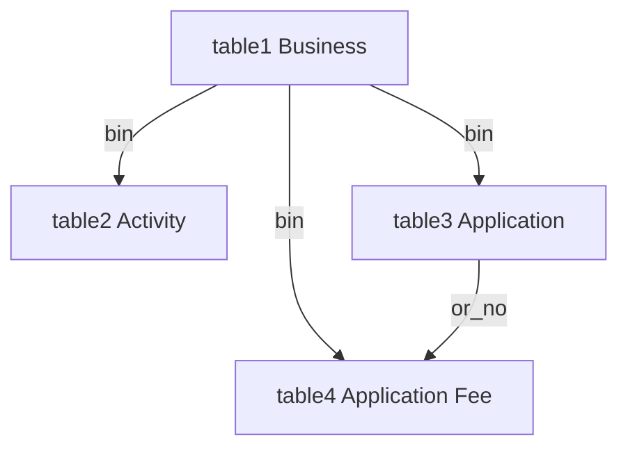

# Cross-table validation for migration CSV prep

## Overview

Strengthen referential integrity across the four migration CSVs (Business → Activity / Application → Fee) so orphan BINs and OR numbers are caught before eLGU import — while still allowing single-table or partial-pack validation with helpful tips.

## The four tables

| # | Table | Role | Key fields |
|---|--------|------|------------|
| 1 | **Business** | Master list of businesses | `bin` |
| 2 | **Business Activity** | Lines of business under a firm | `bin` |
| 3 | **Application** | Permit/payment transactions | `business_bin`, `or_no` |
| 4 | **Application Fee** | Fee lines under a payment | `business_bin`, `application_or_no` |



## Confirmed requirements

These four referential rules apply when the parent sheet is loaded and validated:

1. Every Activity `bin` must exist in Business `bin`
2. Every Application `business_bin` must exist in Business `bin`
3. Every Fee `business_bin` must exist in Business `bin`
4. Every Fee `application_or_no` must exist in Application `or_no`

- Parent **loaded + validated**, child ref missing → **hard error** on child cell
- Parent **not** loaded (or not yet validated) → skip that cross-check; show helpful tip; do not invent orphan errors

## Partial uploads (2 or 3 tables)

Cross-checking activates **per relationship**, not only when all four files are present.

| Uploaded | Checks that run | Skipped (tip only) |
|----------|-----------------|--------------------|
| Business + Activity | Activity `bin` → Business | — |
| Business + Application | Application `business_bin` → Business | — |
| Business + Fee | Fee `business_bin` → Business | Fee OR → Application |
| Application + Fee | Fee `application_or_no` → Application | BIN → Business |
| Business + Activity + Application | Both BIN checks | OR (no Fee) |
| Business + Application + Fee | BIN (App + Fee) + OR | — |
| Activity + Application + Fee | Fee OR → Application | BIN → Business |
| Business + Activity + Fee | BIN (Activity + Fee) | Fee OR → Application |
| Activity only / Fee only | Field rules only | Matching tip(s) |

## Implementation

### 1. Expand MasterStore

```js
MasterStore = {
  validBINs: new Set(),  // from table1.bin
  validORs: new Set()    // from table3.or_no (trimmed, non-empty)
}
```

- Rebuild `validBINs` when Business finalizes
- Rebuild `validORs` when Application finalizes

### 2. Fee → Application OR check

When Application is loaded + validated: if Fee `application_or_no` not in `validORs` → hard error: `OR not found in Application sheet`

### 3. BIN orphan messages

Use: `BIN not found in Business sheet` (Activity / Application / Fee)

### 4. Ordered validation pass

On Validate, run loaded tables in order:

1. Business  
2. Business Activity  
3. Application  
4. Application Fee  

### 5. Flexible tips

- Without Business: `Tip: Cross-table BIN check is off until you load and validate the Business sheet.`
- Fee without Application: `Tip: Cross-table OR check is off until you load and validate the Application sheet.`

## Files

- `index.html` — live app
- `logic.js` — parity copy

## Out of scope

- Reverse orphans (Business with no Activity)
- Fee year warnings, PIN loosen, activity_type UI, compliance report, code split
- Application quarter required flags / Fee column casing

## Manual test cases

1. Activity BIN missing from Business (Business loaded) → error on Activity `bin`
2. Application BIN missing from Business → error on `business_bin`
3. Fee BIN missing from Business → error on `business_bin`
4. Fee OR missing from Application → error on `application_or_no`
5. Fee OR present in Application → passes OR check
6. All four loaded → child checks see updated stores
7. Activity only → field rules + tip; no false BIN orphans
8. Fee only → field rules + tip; no false OR orphans
9. Business + Fee only → BIN check on; OR tip off
10. Application + Fee only → OR check on; BIN tip off
