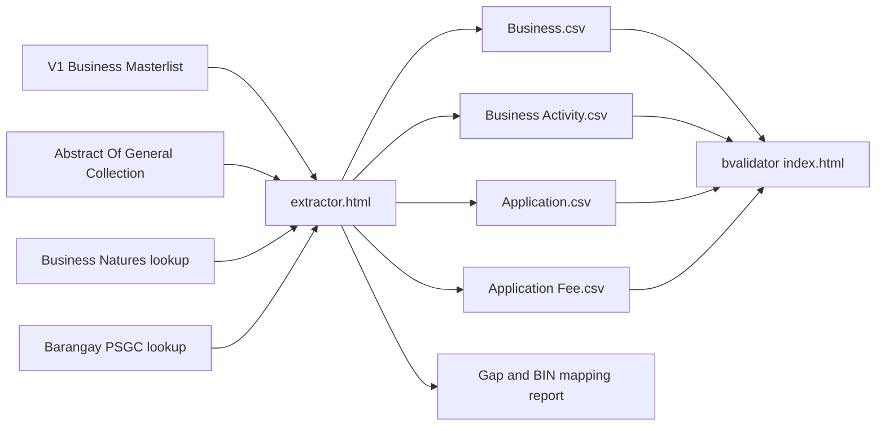

# V1 Masterlist → V2 CSV Extractor

## Overview

Companion tool to **bvalidator** that extracts BPLS V1 data and formats it into the four V2 CSV tables used for eLGU migration.

| Page | Role |
|------|------|
| `index.html` | Validator — clean/check the 4 V2 CSVs |
| `extractor.html` | Extractor — V1 → 4 V2 CSVs + gap/mapping report |

**Branch (planned):** `Extractor-v1-2-v2`

## Verdict: Does V1 meet all needed V2 data?

**No.** The V1 Business Masterlist can seed much of Business / Activity / Application, but it is **not sufficient alone** for clean V2 import. Several required V2 fields are missing or not in V2 format. A second file (Abstract Of General Collection) supplies fee line breakdowns.

## Input files

| File | Required? | Purpose |
|------|-----------|---------|
| Business Masterlist (`.xls`/`.xlsx`) | Yes | Business, Activity, Application |
| Abstract Of General Collection (`.xls`/`.xlsx`) | Preferred | Application Fee line items |
| Business Natures (embedded from `Business Natures.xlsx`) | Default embed | Nature text → `business_line_code` |
| Barangay PSGC (embedded Region 2 + optional CSV) | Default embed | Barangay name → `office_barangay_code` |

### V1 Masterlist columns (sample)

`No.`, `Business Identification Number`, `Permit No.`, `Business Name`, owner name parts, `Sex`, `Business Address`, `Address of the Owner`, `Application Date`, `Type of Application`, `Tax Year`, `Capital Investment`, `Gross Sales`, `Mode of Payment`, `Type of Business`, `Total Amount Paid`, `O.R. Number`, `O.R. Date`, `TIN`, `Registration No.`, employee counts, `Contact Number`, `Email Address`, `Nature of Business`, `Plate No.`, `Application Method`, `Date Issued`, `Barangay (Business Address)`, `Online Payment`, `Business Area`, `Floor Area`, capital/gross breakdowns, `Surcharge`, `Interest`, `Valid Until`, `Trade Name`

**Sample quirks:** V1 BIN like `C-021528-00045`; contacts like `N/A ,09161644309`; TIN ends with `__`; Floor Area / Owner Address / Trade Name often blank; Nature is text (e.g. `MTOP`), not a line code.

---

## Locked decisions

### 1. BIN rebuild (confirmed)

- V1 BINs are **not** V2-compatible and are **not** copied into CSVs.
- Rebuild each V2 BIN as `PSGC7-YEAR4-INC7` using:
  - selected LGU PSGC prefix (Province → Municipality)
  - year from Tax Year
  - sequential 7-digit increment per distinct V2 Business
- Export mapping: `v1_bin,v2_bin,business_name,owner`

### 1b. Duplicate V1 BINs (confirmed)

V2 **Business** `bin` must be **unique**. Children (Activity / Application / Fee) may share one BIN.

Sample V1 collisions that are different businesses:

- `B-021528-00112` → BITS AND BYTES vs ST PATRICK MEDICAL CLINIC
- `I-021528-00008` → two KALESA rows, different owners

**Rule:** one new V2 BIN per distinct business identity  
**Identity key:** `normalize(business_name) | normalize(last_name) | normalize(first_name)`  
Same identity across years/ORs → one Business + many Application/Fee rows.

### 2. Business line codes (confirmed)

- Embed `Business Natures.xlsx` (`LOB CSV`: NATURE CODE, BUSINESS NATURE, LINE CODE, Is Active, BUSINESS LINE).
- Match V1 `Nature of Business` → `BUSINESS LINE` → `LINE CODE` (case-insensitive).
- Prefer `Is Active = Yes`; fall back to inactive if needed.
- Allow upload to override/extend.
- Unmatched → blank + gap report.

### 3. Province + municipality → barangay PSGC (confirmed)

- Field is on **Business (Table 1):** `office_barangay_code` (not Activity).
- UI: user selects **Province → Municipality** first.
- That sets BIN PSGC7 prefix and scopes barangay name matching.
- **Option C:** embed **all Region 2** barangay PSGC codes (`data/barangays-region2.js` — 93 LGUs, ~2600 name keys from PSA/psgc2) + allow CSV (`barangay_name,psgc_code`) override/add.
- Codes stored as 10-digit (e.g. Tuao Fugu `0201528015`).
- Unmatched barangays → gap report.

### 4. Application Fee from Abstract (confirmed)

Upload Abstract Of General Collection as second file.

- Header row ~6: Date, O.R. Number, V1 BIN, names, then fee columns, ending with Interest, Surcharge, Total.
- Unpivot non-zero fee columns (exclude Interest / Surcharge / Total) into Fee rows.
- Join Application by OR; Business via V1→V2 BIN map.
- **Fallback:** if Abstract missing or OR unmatched → one `TOTAL` / `OTHER` row from masterlist Total Amount Paid + gap note.

---

## Coverage by V2 table

### Table 1 — Business

| V2 field | V1 / handling |
|----------|----------------|
| `business_name`, owner names, sex, email, employees, tin, trade_name, area | Present (clean as needed) |
| `cellphone_no` | Parse dirty contact → `639xxxxxxxxx` |
| `business_type` | Map e.g. Sole Proprietorship → `SOLE PROPRIETORSHIP` |
| `dti_no` / sec / cda | Generic Registration No. → DTI if sole prop; **no DTI expiry in V1** |
| `bin` | Rebuild V2 format; do not reuse V1 |
| `office_barangay_code` | Resolve via Province/Municipality + barangay lookup |
| incharge address | Parse Business/Owner address; fill muni/province from LGU selector |
| `incharge_country_of_citizenship` | Default `Philippines` |
| `location_owned`, tdn/pin, lessor, rental | Missing → gap report / defaults as needed |
| `floor_area` | Often blank → fallback to `area` or `0` |
| `no_of_van` / `truck` / `motorcycle` | Default `0` |
| `activity_type` | Default `MAIN OFFICE` |
| `no_of_employees_residing_within_the_area` | Default `0` |

### Table 2 — Business Activity

| V2 field | Handling |
|----------|----------|
| `bin` | Rebuilt V2 BIN |
| `business_line_code` | From Business Natures match |
| `capital_amount`, `gross_amount` | From masterlist |
| `gross_amount_essential` / `nonessential` | Parse text like `MTOP - 0.00` |
| `retired_date` | Leave blank |
| Multi-nature | One Activity row per nature when comma-separated |

### Table 3 — Application

| V2 field | Handling |
|----------|----------|
| `business_bin`, dates, year, OR, permit, amounts, valid_until | Map from masterlist |
| `application_type` | `new`/`Renew` → `N`/`R` |
| `mode_of_payment` | Online Yes → `ONLINE`, else `MANUAL` |
| `qtr_from` / `qtr_to` | Default `1`/`4` for Annual; derive for Quarterly/Bi-annual when possible |
| `discount` | Default `0` |
| `total` | amount + surcharge + interest - discount |

### Table 4 — Application Fee

| V2 field | Source |
|----------|--------|
| `application_or_no` | Abstract O.R. Number |
| `business_bin` | V1 BIN → V2 BIN map |
| `code` | Slug from fee column (max 20) |
| `description` | Column header (max 100) |
| `type` | Heuristic: PERMIT / GARBAGE / SANITARY / LICENSE / OTHER |
| `amount` | Column value |
| `discount` | `0` |
| `Interest` / `Surcharge` | `0` on lines (app-level already on Application) |
| `total` | `amount` |
| `qtr_from` / `qtr_to` / `year` | From matching Application |

---

## Tool UX

1. Select **Province → Municipality** (required)
2. Upload **Business Masterlist** (required)
3. Upload **Abstract Of General Collection** (optional, preferred)
4. Optional override uploads: barangay CSV, business natures CSV/XLSX
5. Preview match rates (barangays, natures, Abstract ORs)
6. Export:
   - Business.csv
   - Business Activity.csv
   - Application.csv
   - Application Fee.csv
   - gap_and_bin_mapping.csv

Output headers must match validator `FIELD_ORDER` in `index.html`.

---

## What LGU still fills after extract

- Confirm rebuilt BINs (via mapping report)
- Fix unmatched barangay names
- Fix unmatched business natures / line codes
- DTI expiry and correct DTI/SEC/CDA
- Location owned/rented + TDN/PIN or lessor/rent
- Floor area when blank
- Citizenship if not Philippines
- Fee rows for ORs with no Abstract match (or replace TOTAL fallbacks)

---

## Defaults for missing fields

| Field | Default |
|-------|---------|
| Citizenship | `Philippines` |
| Vehicles | `0` |
| Residing employees | `0` |
| Activity type | `MAIN OFFICE` |
| Discount | `0` |
| Quarters (annual) | `1` to `4` |
| Floor area if blank | `area` or `0` |

---

## Out of scope (v1 of extractor)

- Changing the validator itself
- Live eLGU Core API calls
- Preserving/decoding V1 letter-prefix BIN meaning
- Requiring Abstract for every period (TOTAL fallback remains)

---

## Implementation checklist

1. Create branch `Extractor-v1-2-v2`
2. Build `extractor.html` (+ JS helpers if needed)
3. Embed Region 2 barangays + Business Natures JSON
4. Implement 4-table mappers, BIN rebuild, cleaners
5. Abstract unpivot + TOTAL fallback
6. Gap/mapping report export
7. Smoke-test with sample Masterlist + Abstract → validate in bvalidator

---

## Related sample files in repo

- `Business Masterlist.xls`
- `Abstract Of General Collection.xls`
- `Business Natures.xlsx`
- `Migration Template.xlsx` (V2 column reference)
- `eLGU - Import CSV Template Guidelines.xlsx` (rules reference)
